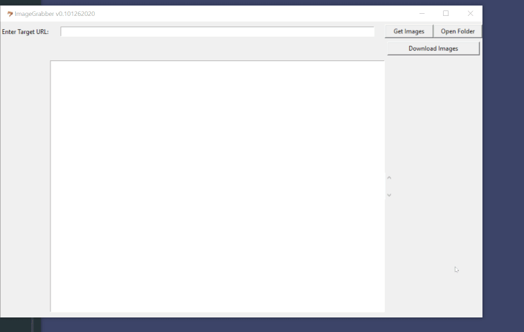

# image_grabber

A graphical tool written in python which scarapes and saves images from a specified website.

*as of 1/30/2020, the app has only been tested on Windows10



## Main Features
1. Find all the links to images on a website (.jpg / .png / .gif)
2. Download the linked images taking advantage of multi-threading. 
3. Saves the images into a  selected folder.

*GIF to show the app in action

## 1. Set up 

Create a new python/conda environment and use the following command in your terminal to install dependencies.
```
$ pip install -r requirements.txt
```

## 2. Start up the application
To start up the application, simply type:
```
$ python image_grabber.py
```

